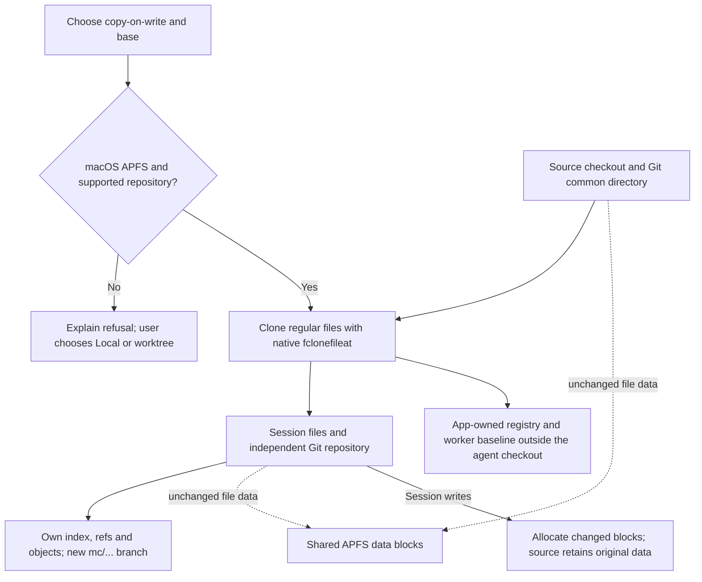
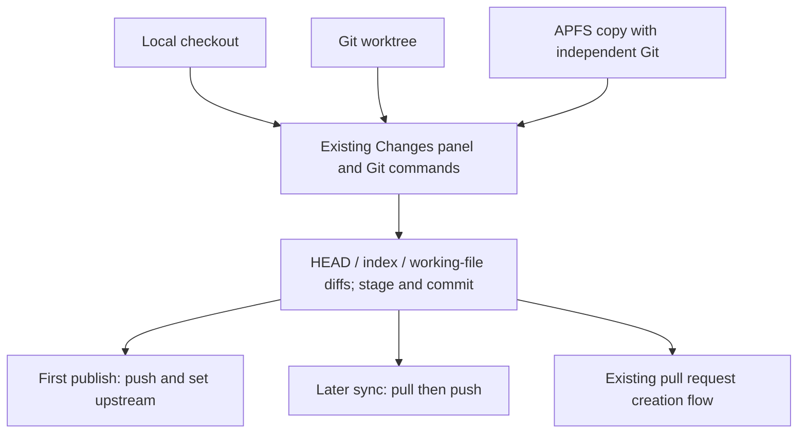
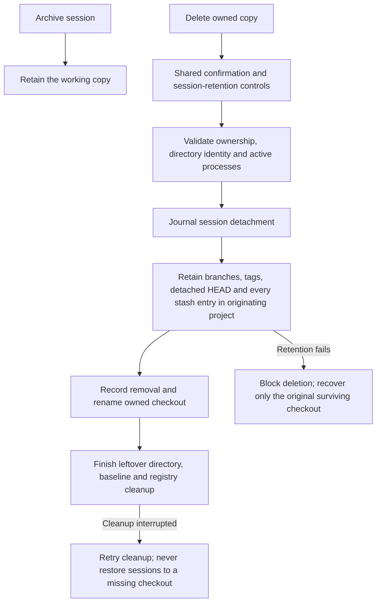

# Work isolation

Choose **Current checkout**, **New worktree**, or **New copy-on-write** in the
composer's Isolation menu. Settings → Work Isolation controls the default for
new sessions. The default is Local. Worktree and copy-on-write sessions use the
same base selector, Changes screen, file diffs, staging, commits, branches,
history, push, and pull request controls. Only workspace creation and
ownership differ.

Copy-on-write requires APFS on macOS. MonoCode refuses normal
copy fallback. Unsupported repositories or filesystems show an explanation;
choose Local or a worktree explicitly. All files remain visible in the copy:
APFS shares their data blocks until writes allocate changed blocks. Directory
entries, file sizes, and ordinary folder-size tools do not establish how much
physical storage is shared. Metadata, captured baselines, and new Git objects
still consume storage. Creation uses native `fclonefileat` for
regular files, including Git objects; there is no byte-copy fallback.

A copy includes current files, dirty edits, ignored dependencies, and secrets
already present in the checkout. Its Git repository is independent, including
when the source is a linked worktree. It retains local branches, remote tracking
refs, tags, and the Git configuration needed by the normal controls, and starts
on a new `mc/…` branch. Selecting another base changes only the copy; Git refuses
to overwrite conflicting dirty or untracked files.
If effective Git filters are configured, creation accepts only the current HEAD.
Another base could require running smudge filters or downloading content; choose
a worktree for that base. This keeps internal creation free of filter execution
and remote access while preserving already converted files in current-HEAD copies.

Git publishing uses the copy's independent branch and index with the originating
repository's effective SSH and credential-helper configuration. Keys and
credential stores stay in their existing locations. Global conditional Git
configuration is resolved against the source before preserving the required
settings, including file conversion filters and line-ending settings, in the
copy; passwords and HTTP authorization headers are not copied
by this configuration step. Internal clone, baseline, and cleanup operations do
not invoke SSH or contact remotes. A first publish pushes and sets the upstream;
later sync operations pull and push. Existing owned copies receive a metadata
upgrade without changing their files, index, branches, or commits.
If an older copy cannot be upgraded because its source is unavailable, its files
and ownership record are retained. Other copies and ordinary projects remain
usable.

Tracked external symlinks, nested repositories, submodules, unresolved indexes,
sparse/split indexes, assume-unchanged or skip-worktree entries, shallow/partial
clones, and object alternates are rejected. Copy-on-write isolates files;
provider permissions, ports, databases, and external services keep their existing
rules.

Creation checks tracked and nonignored repository content for concurrent edits.
Ignored runtime logs and caches are captured per file with native APFS clones;
background writes and directory timestamp changes do not require the checkout
to be idle. Git-ignored Unix sockets and dangling runtime/dependency symlinks
are omitted; missing link targets are not repaired. Permission errors and
symlink cycles still fail explicitly. A repository file, HEAD, file
list, or ref change still aborts creation with the relevant path or condition.

Untracked and ignored external symlinks are materialized as private APFS copies
of their targets. Internal symlinks remain links inside the copy. Editing a
materialized skill or dependency cannot change its external original. Cycles,
ancestor targets (including APFS mount aliases), excessive nesting, nested Git
repositories, unsupported filesystems, and special targets are rejected. An
untracked linked directory becomes ordinary untracked files in the copy; users
can stage those files through the existing Git controls. Worker integration
refuses to write through the original source link. Tracked external links remain
unsupported because materialization would change their tracked Git type.

## Creation and storage

[Exported diagram](assets/work-isolation/creation.svg)

## Shared Git controls

[Exported diagram](assets/work-isolation/git-flow.svg)

Normal Git Changes shows differences against HEAD and the index, including
inherited dirty edits. Users decide what to stage and commit, exactly as in a
local checkout. Ignored files remain ignored. No automatic publication occurs.
Completed-turn review, Keep, Undo, and unchanged-worker cleanup use the same
session checkpoints as worktrees. The captured copy baseline is used for worker
delta integration, where inherited changes must be excluded. An explicitly
selected existing workspace takes precedence over the default isolation setting.

Ownership records live in app data under `isolation`. New baselines live outside
session checkouts at `<project>-cow/.baselines/<cowId>` on the clone's filesystem.
Existing app-data baselines remain readable without recapturing the baseline.
Source verification compares file identities, sizes, modes, nanosecond timestamps,
and symlink targets; it does not read ignored file contents. Snapshot capture
imports eligible file and symlink blobs through one Git process. Helper responses
omit private baselines and ignored-file lists. Host ownership checks read only
registered metadata and directory identities, without waiting for the mutation
lock or calculating Git status.

Creation records a durable intent before cloning files. If interrupted before
registration, a later locked isolation request cleans up the abandoned checkout
and baseline only when their recorded directory identities still match. Replaced
or unrelated paths are retained. Completed registration is published atomically.

## Archive and deletion

[Exported diagram](assets/work-isolation/cleanup.svg)

Archived sessions retain their working copies. Work Isolation settings lists
both isolation types with their current branch, uncommitted changes, and
unpublished commits, and uses the same deletion confirmation and session
retention controls. Deleting a copy preserves its branches and commits in the
originating project before removing files; conflicting branch names are retained
under `mc/kept-<cowId>/…` without overwriting existing branches. Failure to retain
history blocks deletion, including forced deletion. Deleting a session can also
remove its unused clean working copy.
Unchanged inherited branches and tags are skipped, so cleanup does not recreate
source refs the user deleted or duplicate source history changed independently.
The session's generated branch is still retained. Older records without creation
ref metadata retain uncertain history under the copy's `mc/kept-<cowId>/…` namespace.

Stashed work is retained in the originating repository before deletion, including
older stash entries. Session detachment is journaled on desktop and remote hosts
so interrupted removals can be recovered on restart. Once the checkout has been
deleted, leftover metadata cleanup cannot restore sessions to the deleted path.
Internal cleanup never executes file conversion filters. If a filter prevents a
safe cleanliness check, automatic deletion is refused; review Changes and use
the existing explicit deletion confirmation instead.

The workspace switcher lists owned copies alongside Git worktrees. Selecting a
copy opens its owning session. Starting another session from a copy creates an
independent copy rather than sharing the original session's checkout.

Verification: `npm run check`, `npm run test:host`, and `npm run host:package`.
Native integration tests use real Git repositories and local bare remotes. Set
`MONOCODE_REQUIRE_COW=1` to require filesystem support; CI requires native APFS
coverage on macOS. Linux and Windows use Local or worktrees. GitHub PR creation
still requires a configured account and repository, just as for worktrees.
